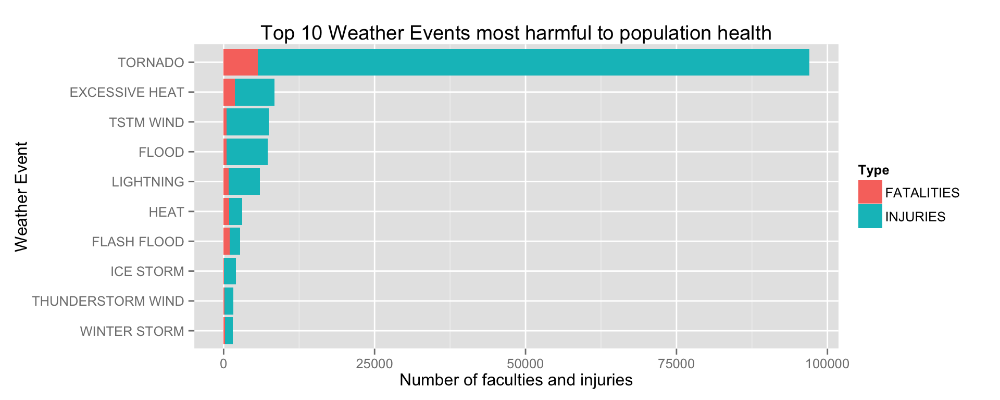
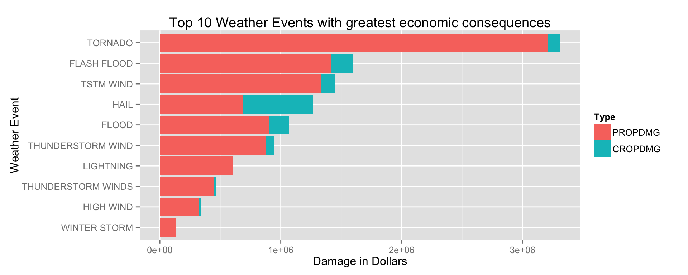

# Reproducible Research: Course Project 2
Martijn van Gorp  
13 April 2016  
***
## Basic Analysis on the Impact of Severe Weather Events

#### Synopsis

#### Data processing

##### Download file

```r
dataurl = 'https://d396qusza40orc.cloudfront.net/repdata%2Fdata%2FStormData.csv.bz2'
datafile = 'stormdata.csv.bz2'

# Check if already present
if(!file.exists(datafile)) { download.file(dataurl,datafile) }
```

##### Read the data
The function read.csv can read bz2 files, so no need to unzip

```r
data = read.csv(datafile, header = TRUE, sep=",")

# Show first few rows to get an idea of the raw dataset
head(data)
```

```
##   STATE__           BGN_DATE BGN_TIME TIME_ZONE COUNTY COUNTYNAME STATE
## 1       1  4/18/1950 0:00:00     0130       CST     97     MOBILE    AL
## 2       1  4/18/1950 0:00:00     0145       CST      3    BALDWIN    AL
## 3       1  2/20/1951 0:00:00     1600       CST     57    FAYETTE    AL
## 4       1   6/8/1951 0:00:00     0900       CST     89    MADISON    AL
## 5       1 11/15/1951 0:00:00     1500       CST     43    CULLMAN    AL
## 6       1 11/15/1951 0:00:00     2000       CST     77 LAUDERDALE    AL
##    EVTYPE BGN_RANGE BGN_AZI BGN_LOCATI END_DATE END_TIME COUNTY_END
## 1 TORNADO         0                                               0
## 2 TORNADO         0                                               0
## 3 TORNADO         0                                               0
## 4 TORNADO         0                                               0
## 5 TORNADO         0                                               0
## 6 TORNADO         0                                               0
##   COUNTYENDN END_RANGE END_AZI END_LOCATI LENGTH WIDTH F MAG FATALITIES
## 1         NA         0                      14.0   100 3   0          0
## 2         NA         0                       2.0   150 2   0          0
## 3         NA         0                       0.1   123 2   0          0
## 4         NA         0                       0.0   100 2   0          0
## 5         NA         0                       0.0   150 2   0          0
## 6         NA         0                       1.5   177 2   0          0
##   INJURIES PROPDMG PROPDMGEXP CROPDMG CROPDMGEXP WFO STATEOFFIC ZONENAMES
## 1       15    25.0          K       0                                    
## 2        0     2.5          K       0                                    
## 3        2    25.0          K       0                                    
## 4        2     2.5          K       0                                    
## 5        2     2.5          K       0                                    
## 6        6     2.5          K       0                                    
##   LATITUDE LONGITUDE LATITUDE_E LONGITUDE_ REMARKS REFNUM
## 1     3040      8812       3051       8806              1
## 2     3042      8755          0          0              2
## 3     3340      8742          0          0              3
## 4     3458      8626          0          0              4
## 5     3412      8642          0          0              5
## 6     3450      8748          0          0              6
```

##### Load libraries
We use the following libraries for this analysis:

```r
suppressMessages(library(dplyr))
suppressMessages(library(reshape2))
suppressMessages(library(ggplot2))
```

#### Results
Both research questions are related to the statistics per weather event, 
so we can group the data by weather event type. The event type can be found in de columns EVTYPE.

```r
# Group by event
subdata_by_event = data %>% group_by(EVTYPE)
```

We are now prepared to answer the two research questions.

#####Question 1. Across the United States, which types of events are most harmful with respect to population health?
First we have to ask ourselves how we can measure population health. 
If we look at the data set, there are two columns that give the fatalities (FATALITIES) and injuries (INJURIES) for each measured weather event.
So if one or both of these have a high number, we can say that an event has a harmfull effect on population health.

To give an answer to which events are *most* harmful, we work with the Top 10 of weather types.

With the code below, we calculate the SUM of the columns FATALITIES and INJURIES. 
Next to this we calculate the total of both of these so we can sort the result by this total to get a Top 10.

```r
health = subdata_by_event %>% 
    summarise_each(funs(sum), FATALITIES, INJURIES) %>% 
    mutate(TOTAL = (FATALITIES + INJURIES)) %>%
    arrange(desc(TOTAL)) %>%
    top_n(10)
```

```
## Selecting by TOTAL
```

```r
# Show data
health
```

```
## Source: local data frame [10 x 4]
## 
##               EVTYPE FATALITIES INJURIES TOTAL
##               (fctr)      (dbl)    (dbl) (dbl)
## 1            TORNADO       5633    91346 96979
## 2     EXCESSIVE HEAT       1903     6525  8428
## 3          TSTM WIND        504     6957  7461
## 4              FLOOD        470     6789  7259
## 5          LIGHTNING        816     5230  6046
## 6               HEAT        937     2100  3037
## 7        FLASH FLOOD        978     1777  2755
## 8          ICE STORM         89     1975  2064
## 9  THUNDERSTORM WIND        133     1488  1621
## 10      WINTER STORM        206     1321  1527
```
Now, we have the Top 10 of weather events that are most harmful with respect to population health.

We can show this in the following graph:


```r
# Sort data by TOTAL (needed for graph)
health$EVTYPE <- factor(health$EVTYPE, levels = health$EVTYPE[order(health$TOTAL)])

# Make wide tabel into long (remove TOTAL column)
health_long = melt(select(health,-TOTAL), id = c("EVTYPE"))

# Barplot
ggplot(health_long, aes(x = EVTYPE, y = value, fill = variable)) + 
        geom_bar(stat='identity') + 
        xlab('Weather Event') + 
        ylab('Number of faculties and injuries') +
        ggtitle('Top 10 Weather Events most harmful to population health') +
        scale_fill_discrete(name = 'Type') +
        coord_flip()
```



As we can see, a Tornade has the far most harmfull effect to population health, followed by excessive heat, tstm wind, flood, etc.


#####Question 2. Across the United States, which types of events have the greatest economic consequences?
First we have to ask ourselves how we can measure economic consequences. 
If we look at the data set, there are two columns that give the damages for property (PROPDMG) and crop (CROPDMG) for each measured weather event.
So if one or both of these have a high number, we can say that an event has a great economic consequence.

To give an answer to which events have the *greatest* consequences, we work with the Top 10 of weather types.

With the code below, we calculate the SUM of the columns PROPDMG and CROPDMG 
Next to this we calculate the total of both of these so we can sort the result by this total to get a Top 10.

```r
econom = subdata_by_event %>% 
    summarise_each(funs(sum), PROPDMG, CROPDMG) %>% 
    mutate(TOTAL = (PROPDMG + CROPDMG)) %>%
    arrange(desc(TOTAL)) %>%
    top_n(10)
```

```
## Selecting by TOTAL
```

```r
# Show data
econom
```

```
## Source: local data frame [10 x 4]
## 
##                EVTYPE   PROPDMG   CROPDMG     TOTAL
##                (fctr)     (dbl)     (dbl)     (dbl)
## 1             TORNADO 3212258.2 100018.52 3312276.7
## 2         FLASH FLOOD 1420124.6 179200.46 1599325.1
## 3           TSTM WIND 1335965.6 109202.60 1445168.2
## 4                HAIL  688693.4 579596.28 1268289.7
## 5               FLOOD  899938.5 168037.88 1067976.4
## 6   THUNDERSTORM WIND  876844.2  66791.45  943635.6
## 7           LIGHTNING  603351.8   3580.61  606932.4
## 8  THUNDERSTORM WINDS  446293.2  18684.93  464978.1
## 9           HIGH WIND  324731.6  17283.21  342014.8
## 10       WINTER STORM  132720.6   1978.99  134699.6
```
Now, we have the Top 10 of weather events that have the greatest economic consequences.

We can show this in the following graph:


```r
# Sort data by TOTAL (needed for graph)
econom$EVTYPE <- factor(econom$EVTYPE, levels = econom$EVTYPE[order(econom$TOTAL)])

# Make wide tabel into long (remove TOTAL column)
econom_long = melt(select(econom,-TOTAL), id = c("EVTYPE"))

# Barplot
ggplot(econom_long, aes(x = EVTYPE, y = value, fill = variable)) + 
        geom_bar(stat='identity') + 
        xlab('Weather Event') + 
        ylab('Damage in Dollars') +
        ggtitle('Top 10 Weather Events with greatest economic consequences') +
        scale_fill_discrete(name = 'Type') +
        coord_flip()
```


As we can see, a Tornade has the greatest economic consequences, followed by flash flood, tstm wind, hail, etc.

